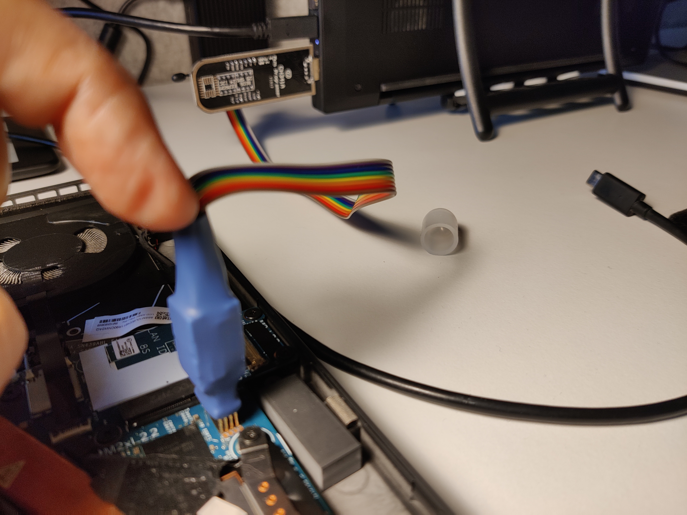

# Lenovo x1 nano gen 1 -- Bricked
A few days ago I bricked my Lenovo x1 Nano Gen 1 while updating the bios/fw from Linux.  
The machine power up, but it was stuck in a recovery state and I couldn't do much.  


## Machine details
Lenovo X1 Nano Gen 1  
Type: 20UN - X021US  

## How to fix it?
As soon as the laptop stared I ended up in the above screen and I could not do anything more.  
I tried a few stuff with the reset button, the power button, some weird keys combinations,  
but I quickly realized that the fix required some more low level operations.  

### Tools
Reading on a few forums I figured out that a possible solution would have been to try flashing the BIOS directly to the right chip using a chip programmer.  
I choosed to go with the cheapest option:
 * CH341A programmer
 * WSON8 pogo pin
 * [flashrom software](https://www.flashrom.org/): opensource flash programmer compatible with CH341A


### Identify the BIOS Chip
Thank to the information I found on https://www.badcaps.net/ I managed to find the chip I needed to flash on the motherboard.  
After opening the laptop and removing the battery I identified the chip ***Winbond 25R256JVEQ*** that fortunately was pretty easy to reach without having to completely remove the motherboard.


### Program the chip
I decided to install from source flashrom, detailed information can be found [here](https://www.flashrom.org/dev_guide/building_from_source.html), nothing complicated.  

NOTE: there is no official support to read/write the ***Winbond 25R256JVEQ*** , but there is partial support for similar chips, so I used this command to flash the bios:
```bash
sudo ./flashrom/builddir/flashrom --programmer ch341a_spi -c W25Q256JV_Q -w X1_Nano_Gen_1_Laptop_ThinkPad_-_Type_20UN.bin
```
The flash process takes about 10 minutes, and you need to have a steady hand in keeping the pogo pin in place.



### Success!
After reassemblying the machine the system booted without issues!
